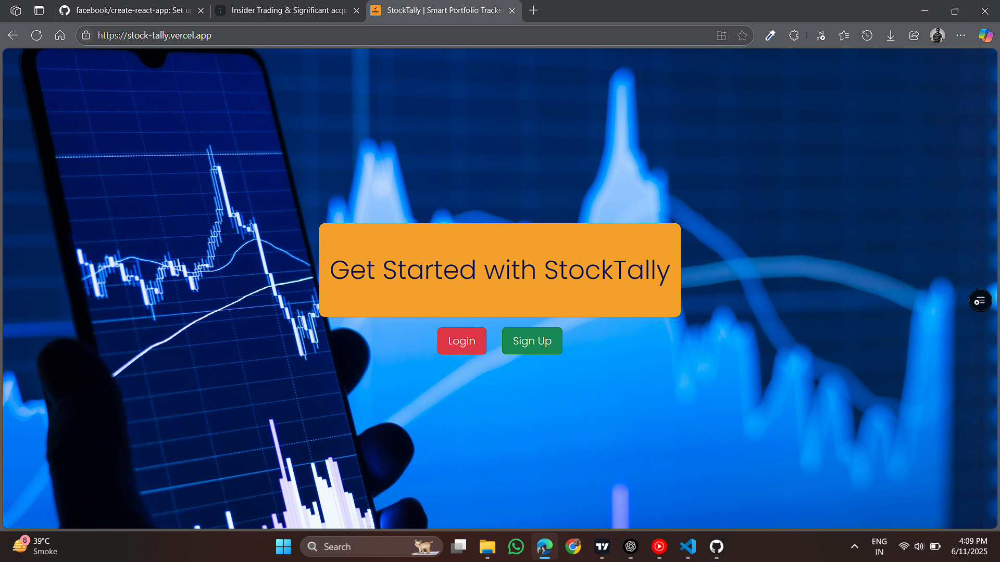
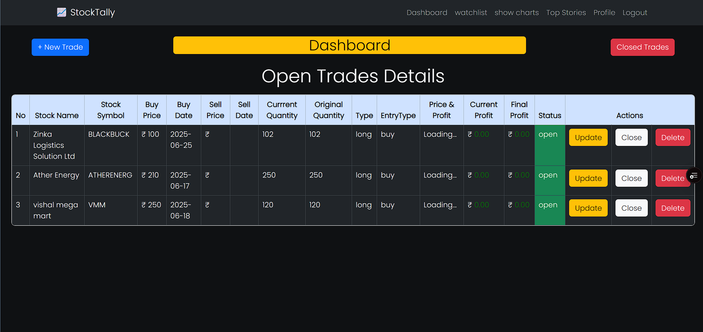
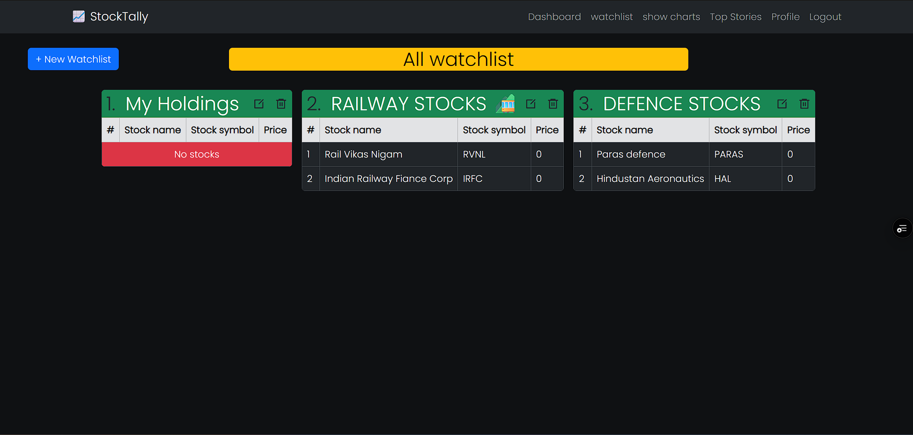

# 📊 StockTally

**StockTally** is a stock trade and watchlist management app built using **React** (via Create React App) and the **MERN stack**. It allows users to track trades, organize stock watchlists, and analyze portfolio activity with a clean, responsive interface.

---

## 🚀 Features

- ✅ Create, Read, Update, Delete (CRUD) operations for:
  - **Trades** – manage your stock buying/selling records
  - **Watchlists** – keep an eye on stocks you're interested in
- 🔐 User Authentication (Sign Up / Login)
- 📱 Responsive UI using Bootstrap
- 🌍 Backend API built with Node.js, Express, MongoDB (MongoDB Atlas)

---

## 🖼️ Screenshots

### 🏠 Home / Dashboard



### 💼 Trade Management



### 📋 Watchlist Page



---

## 🧰 Tech Stack

- **Frontend:** React.js (CRA), Bootstrap, Context API
- **Backend:** Node.js, Express.js
- **Database:** MongoDB (Atlas)
- **Deployment:** Vercel (Frontend), Render (Backend)

---

## 📦 Getting Started with Create React App

This project was bootstrapped with [Create React App](https://github.com/facebook/create-react-app).

### Prerequisites

- Node.js and npm
- MongoDB Atlas connection URI
- (Optional) Postman for API testing

---

## 📁 Project Structure

```
stocktally/
├── Frontend/           # React frontend (CRA)
│   ├── public/
│   ├── src/
│   │   ├── components/
│   │   ├── Middleware/
│   │   ├── pages/
│   │   ├── Utils/
│   │   ├── context/
│   │   └── App.js
├── Backend/           # Express backend
│   ├── config/
│   ├── controllers/
│   ├── middlewares/
│   ├── models/
│   ├── public/
│   ├── Routes/
│   ├── services/
│   ├── utils/
│   ├── .env
│   ├── .app.js
│   └── server.js
```

---

## 🔧 Installation

### 1. Clone the repo

```bash
git clone https://github.com/Dp20703/stocktally.git
cd stocktally
```

### 2. Setup the backend

```bash
cd server
npm install
npm run dev
```

### 3. Setup the frontend

```bash
cd ../client
npm install
npm start
```

---

## 🖥 Available Scripts (Frontend)

In the `client/` directory:

### `npm start`

Runs the app in the development mode.\
Open [http://localhost:3000](http://localhost:3000) to view it in your browser.

### `npm test`

Launches the test runner in the interactive watch mode.

### `npm run build`

Builds the app for production to the `build` folder.

### `npm run eject`

**Note:** This is a one-way operation. Once you eject, you can’t go back!

---

## 📚 Learn More

- [React Docs](https://reactjs.org/)
- [Create React App Docs](https://facebook.github.io/create-react-app/)
- [MongoDB Docs](https://www.mongodb.com/docs/)
- [Express.js Guide](https://expressjs.com/)

---

## 👤 Author

**Darshan Prajapati**  
[LinkedIn](https://www.linkedin.com/in/darshan-prajapati-523202282) | [GitHub](https://github.com/Dp20703)

---

> Built for traders, by a tech enthusiast 💼📈
