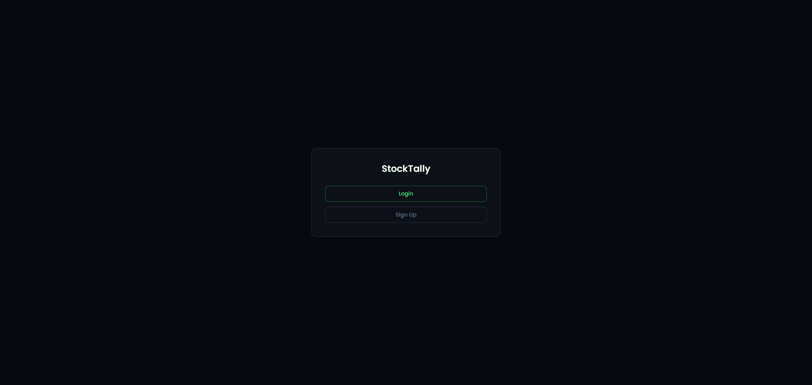
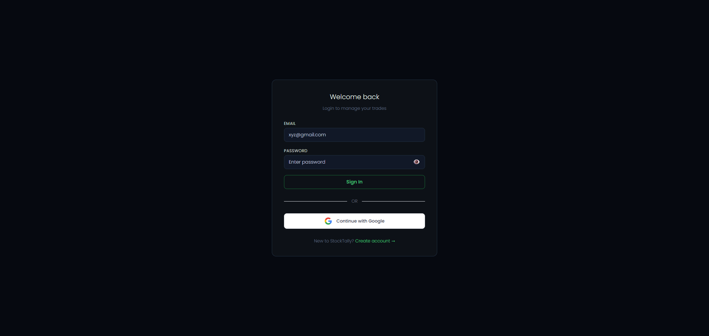
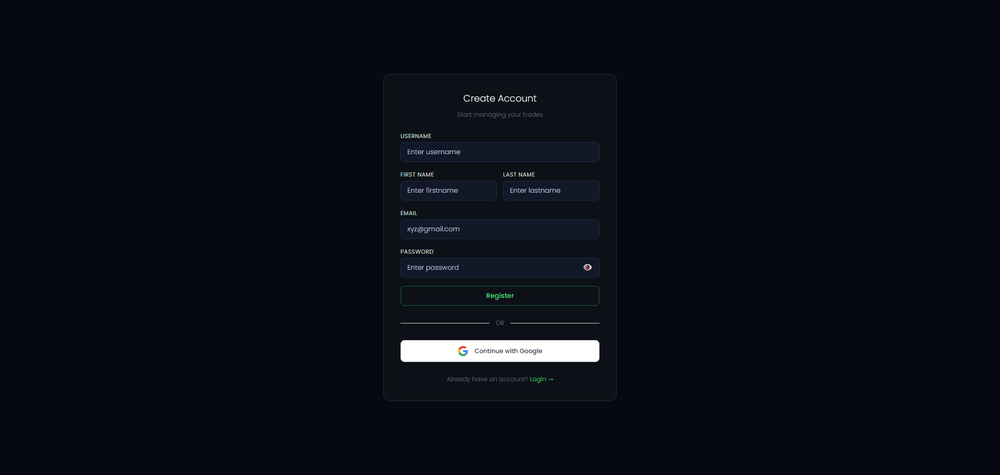
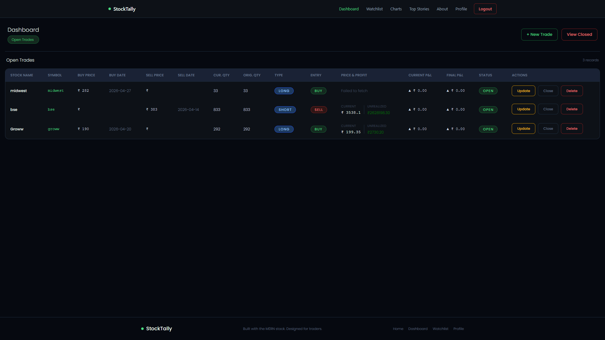

# 📊 StockTally


**StockTally** is a stock trade and watchlist management app built using the **MERN stack**. It allows users to track trades, manage watchlists, and analyze portfolio activity with a clean and responsive UI.

---

## 🌐 Live Demo

🔗 https://stock-tally.vercel.app

---

## 🚀 Features

* ✅ CRUD operations for:

  * **Trades** – manage stock buy/sell records
  * **Watchlists** – track stocks of interest
* 🔐 User Authentication (Sign Up / Login)
* 📱 Fully responsive UI (Bootstrap)
* 🌍 REST API with Node.js & Express
* ☁️ MongoDB Atlas integration

---

## 🖼️ Screenshots

### 🏠 Home

<p align="center">
  
</p>

### 📝 Login

<p align="center">
  
</p>

### 📝 Register

<p align="center">
  
</p>

### 💼 Trade Dashboard

<p align="center">
  
</p>

### 📋 Watchlist

<p align="center">
  
</p>

---

## 🧰 Tech Stack

* **Frontend:** React.js (CRA), Bootstrap, Context API
* **Backend:** Node.js, Express.js
* **Database:** MongoDB (Atlas)
* **Deployment:** Vercel (Frontend), Render (Backend)

---

## 📁 Project Structure

```
stocktally/
├── Frontend/
│   ├── public/
│   ├── src/
│   │   ├── components/
│   │   ├── context/
│   │   ├── pages/
│   │   ├── services/
│   │   └── App.jsx
├── Backend/
│   ├── config/
│   ├── controllers/
│   ├── middlewares/
│   ├── models/
│   ├── routes/
│   ├── utils/
│   ├── .env
│   └── server.js
├── screenshots/
│   ├── home.png
│   ├── login.png
│   ├── signup.png
│   ├── dashboard.png
│   └── watchlist.png
```

---

## 🔧 Installation

### 1. Clone the repository

```bash
git clone https://github.com/Dp20703/stocktally.git
cd stocktally
```

---

### 2. Setup Backend

```bash
cd Backend
npm install
npm run dev
```

---

### 3. Setup Frontend

```bash
cd ../Frontend
npm install
npm start
```

---

## 🖥 Available Scripts (Frontend)

Inside `Frontend/`:

* `npm start` → Run app in development mode
* `npm run build` → Build for production
* `npm test` → Run tests
* `npm run eject` → Eject CRA config (irreversible)

---

## ✨ Future Improvements

* 📊 Profit/Loss analytics dashboard
* 🔔 Real-time stock price integration
* 📱 Mobile app version
* 🧠 AI-based stock suggestions

---

## 📚 Learn More

* https://reactjs.org/
* https://expressjs.com/
* https://www.mongodb.com/docs/

---

## 👤 Author

**Darshan Prajapati**
🔗 https://www.linkedin.com/in/darshan-prajapati-523202282
🔗 https://github.com/Dp20703

---

> Built for traders, by a tech enthusiast 💼📈
